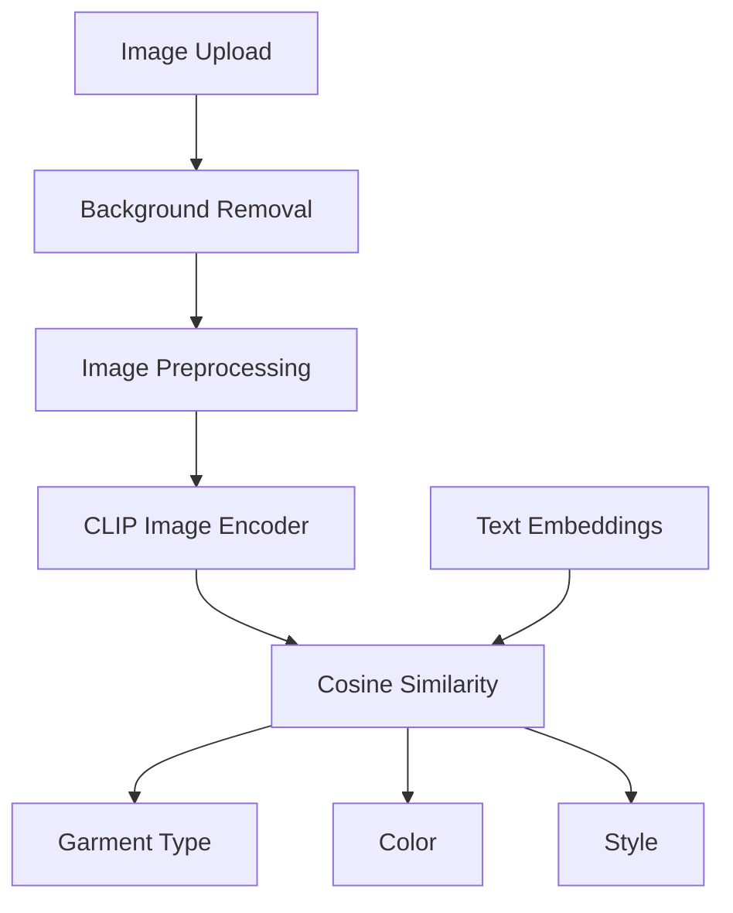

# AI Model

## Overview

Smart Wardrobe includes an AI-based clothing classification module that automatically analyzes uploaded garment images and predicts their characteristics.

The classification system is based on CLIP (Contrastive Language-Image Pretraining), a multimodal model capable of relating images and text within the same embedding space.

The model is used to assist users when adding garments to their wardrobe by automatically suggesting clothing attributes.

## Inputs

The model receives:

* An image uploaded by the user.
* A predefined set of garment types.
* A predefined set of colors.
* A predefined set of styles.

## Outputs

For each uploaded image, the model predicts:

* Garment Type
* Garment Color
* Garment Style

These predictions are returned to the application and can be accepted or modified by the user before saving the garment.

## Supported Garment Types

Examples include:

* T-shirt
* Shirt
* Hoodie
* Sweater
* Jacket
* Coat
* Jeans
* Trousers
* Shorts
* Sneakers
* Shoes
* Boots

## Supported Colors

Examples include:

* Black
* White
* Gray
* Blue
* Red
* Green
* Yellow
* Brown
* Pink
* Purple
* Orange

## Supported Styles

Examples include:

* Casual
* Formal
* Sporty

## Classification Process

The classification workflow consists of the following steps:

1. The user uploads a garment image.
2. The image background may be removed using the background removal service.
3. The image is preprocessed to match the model requirements.
4. CLIP generates an image embedding.
5. Text embeddings are generated for all possible labels.
6. Cosine similarity is computed between image and text embeddings.
7. The labels with the highest similarity scores are selected.
8. The predicted attributes are returned to the frontend.

## Advantages of Using CLIP

The use of CLIP provides several benefits:

* No custom model training is required.
* Supports zero-shot classification.
* Good generalization to unseen images.
* Fast inference times.
* Easy integration with new clothing labels.

## Classification Pipeline

## Limitations

Although CLIP performs well in general scenarios, classification accuracy may decrease when:

* Images have poor lighting conditions.
* Garments are partially occluded.
* Multiple garments appear in the same image.
* The clothing category is not represented in the predefined label set.

For this reason, users are allowed to manually modify the predicted values before saving a garment.
