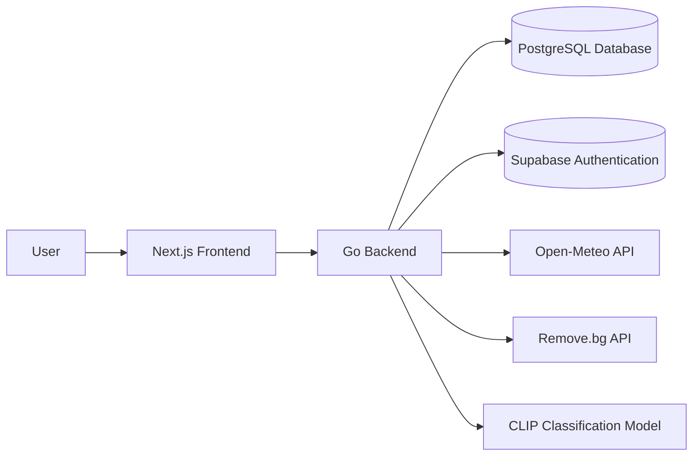

# Architecture Diagram

```mermaid
flowchart LR

    User[User]

    Frontend[Next.js Frontend]

    Backend[Go Backend]

    PostgreSQL[(PostgreSQL Database)]

    SupabaseAuth[(Supabase Authentication)]

    OpenMeteo[Open-Meteo API]
    RemoveBG[Remove.bg API]
    CLIP[CLIP Classification Model]

    User --> Frontend

    Frontend --> Backend

    Backend --> PostgreSQL
    Backend --> SupabaseAuth
    Backend --> OpenMeteo
    Backend --> RemoveBG
    Backend --> CLIP
```