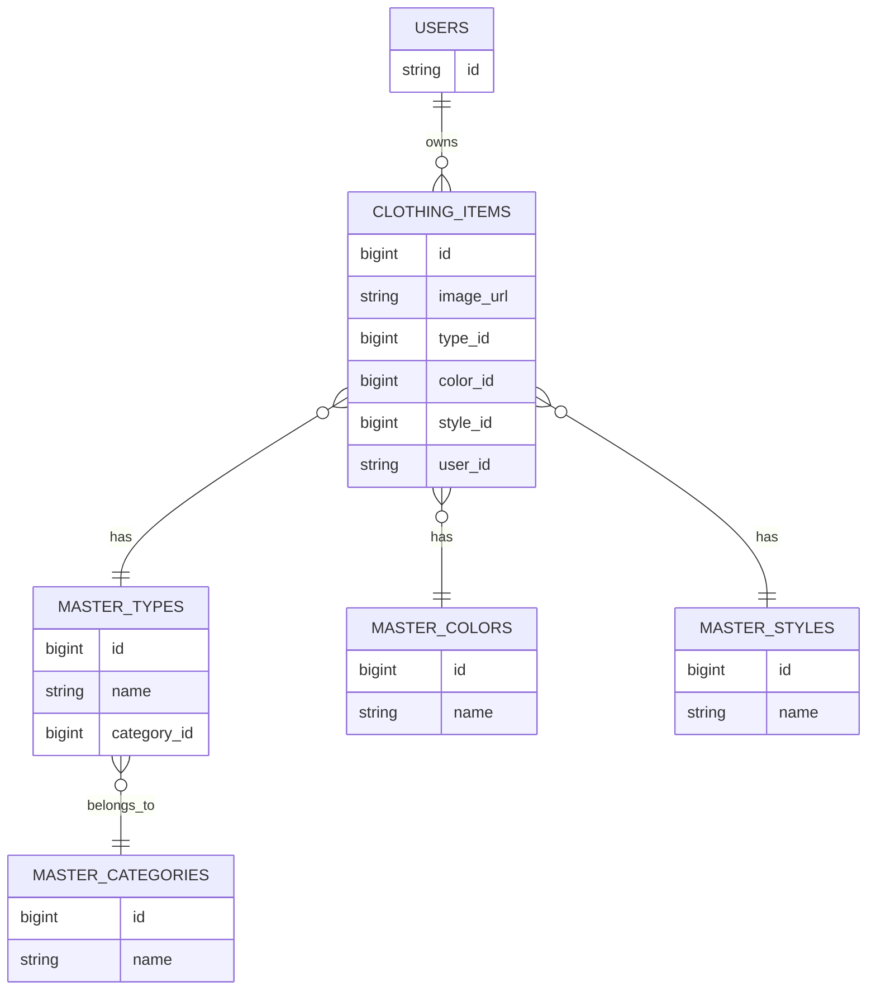

# Entity Relationship Diagram

```mermaid
erDiagram

    USERS {
        string id
    }

    CLOTHING_ITEMS {
        bigint id
        string image_url
        bigint type_id
        bigint color_id
        bigint style_id
        string user_id
    }

    MASTER_TYPES {
        bigint id
        string name
        bigint category_id
    }

    MASTER_COLORS {
        bigint id
        string name
    }

    MASTER_STYLES {
        bigint id
        string name
    }

    MASTER_CATEGORIES {
        bigint id
        string name
    }

    USERS ||--o{ CLOTHING_ITEMS : owns

    CLOTHING_ITEMS }o--|| MASTER_TYPES : has
    CLOTHING_ITEMS }o--|| MASTER_COLORS : has
    CLOTHING_ITEMS }o--|| MASTER_STYLES : has

    MASTER_TYPES }o--|| MASTER_CATEGORIES : belongs_to
```