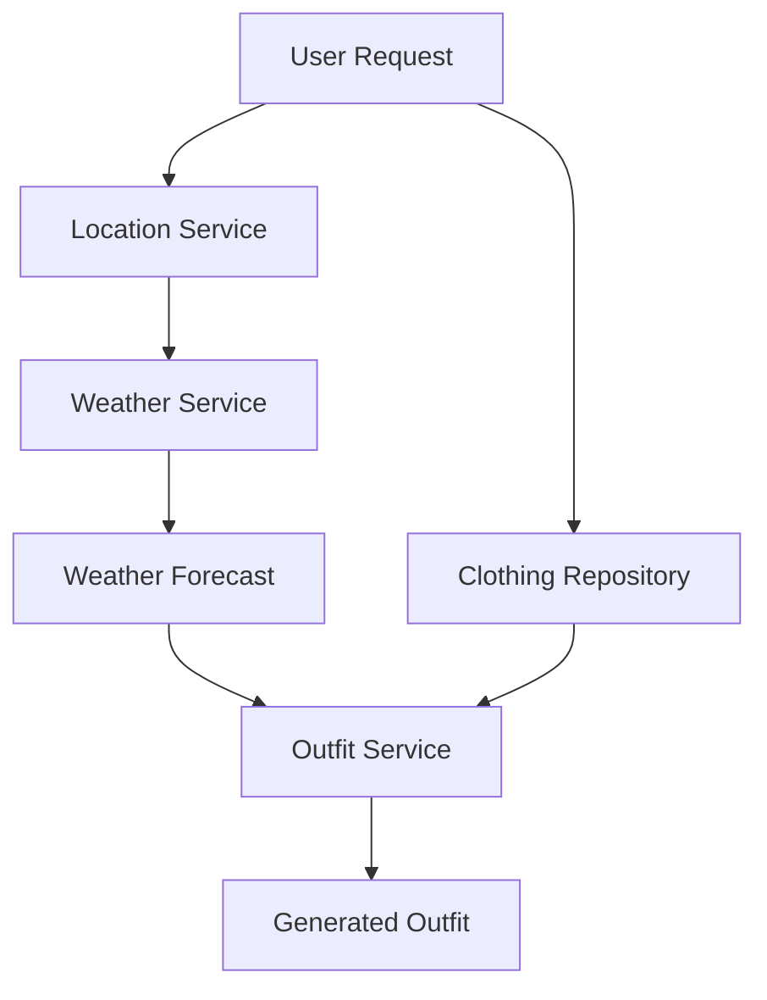

# Outfit Generation Flow

```mermaid
flowchart TD

    A[User Request]
    B[Location Service]
    C[Weather Service]
    D[Weather Forecast]
    E[Clothing Repository]
    F[Outfit Service]
    G[Generated Outfit]

    A --> B
    B --> C
    C --> D

    A --> E

    D --> F
    E --> F

    F --> G
```